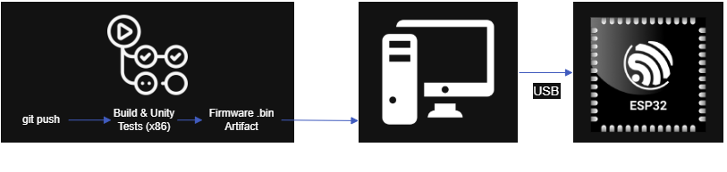
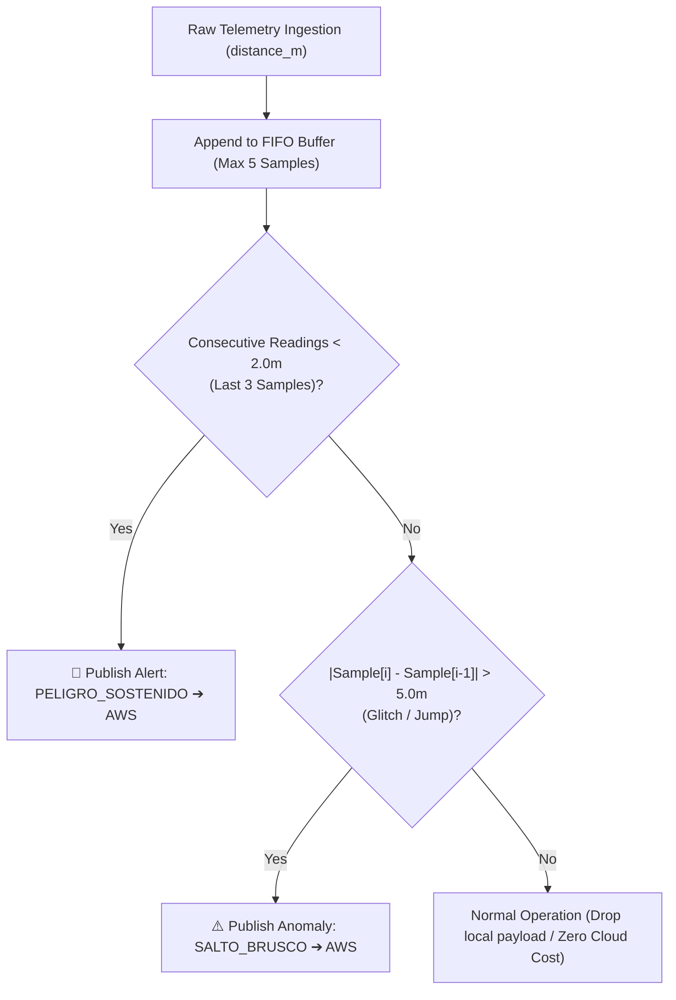

<div align="right">
  🌎 <a href="README-en.md">English</a> | 🇪🇸 <a href="README.md">Español</a>
</div>

# Industrial IoT Edge Gateway: Custom Embedded Linux (Buildroot) & Automated HIL CI/CD Pipeline

[](https://github.com/Rivero-Agustin/embedded-linux-iot-gateway/actions/workflows/build.yml)


An end-to-end **Industrial IoT Collision Avoidance & Edge Gateway** featuring a custom **Embedded Linux (Buildroot)** OS, real-time edge anomaly detection, FreeRTOS dual-core firmware, and a production-grade **CI/CD pipeline with Automated Hardware-in-the-Loop (HIL) Testing**.

---

## 🌟 Executive Summary

> 🎯 **Overview:** Designed for high-risk industrial environments (warehouses, factories, logistics), this project provides a resilient Edge-to-Cloud safety architecture that measures physical distances via UWB with decimetric precision, executes local anomaly and collision hazard filtering on a custom Embedded Linux gateway (>80% cloud traffic reduction), bridges encrypted telemetry to AWS IoT Core, and validates firmware automatically on physical hardware via a custom CI/CD HIL pipeline.

---

## 🏗️ System Architecture & Data Flow


### 📡 MQTT Communication Matrix

| Topic                   | Publisher ➔ Subscriber  | Transport / Security         | Payload Structure / Purpose                                                    |
| :---------------------- | :---------------------- | :--------------------------- | :----------------------------------------------------------------------------- |
| `gateway/uwb/telemetry` | ESP32 ➔ Linux Gateway   | MQTT (TCP:1883 / Local)      | `{"distance_m": 1.45, "role": "ANCHOR"}` — Raw proximity data.                 |
| `gateway/uwb/alerts`    | Gateway ➔ AWS IoT Core  | MQTTS (TLS 1.2:8883 / Cloud) | `{"alerta": "PELIGRO_SOSTENIDO", "distancia": 1.45}` — Critical event payload. |
| `gateway/uwb/commands`  | Cloud / Gateway ➔ ESP32 | MQTT (TCP:1883 / Local)      | Remote calibration & runtime threshold parameter updates.                      |

---

## ⚙️ Key Engineering Highlights & Architectural Decisions

### 1. ⚡ Asymmetric FreeRTOS Dual-Core Architecture (ESP32)

Microcontroller tasks are strategically segregated across physical CPU cores to guarantee hard real-time constraints:

- **Core 1 (High Priority - Level 5):** Executes time-critical UWB Two-Way Ranging (TWR) algorithms operating at nanosecond resolution and drives the I2C SSD1306 OLED display using non-blocking updates (300 ms throttling) to prevent I2C bus saturation.
- **Core 0 (Standard Priority - Level 2):** Manages the networking stack, including Wi-Fi reconnection state machines and the native ESP-IDF MQTT client (`esp_mqtt_client`) with transmission queues.
- **PSRAM & Custom Partitioning:** Configured with custom flash partition tables (`partitions.csv`) and PSRAM cache fix flags for high-throughput sensor telemetry.

### 2. 🐧 Custom Embedded Linux Gateway (Buildroot + QEMU)

- **Minimalist OS Footprint:** Built using a customized Buildroot Linux configuration emulated under QEMU, tailored with minimal packages (Python runtime, Mosquitto broker, OpenSSL).
- **Edge Analytics & Bandwidth Optimization:** A Python edge service processes incoming raw telemetry via a sliding-window buffer ($N=5$). By evaluating safety thresholds locally, cloud payload ingestion is reduced by **>80%**, forwarding only actionable alerts to AWS.

### 3. 🔐 Zero-Trust Cloud Security Model (AWS IoT Core)

- Local edge nodes communicate over an isolated local network (MQTT port 1883).
- The Linux Edge Gateway acts as a secure cryptographic boundary, encrypting outbound alert payloads with **TLS v1.2 / MQTTS (Port 8883)** using X.509 device certificates and private keys generated in AWS IoT Core.

---

## 🧪 CI/CD & Hardware-in-the-Loop (HIL) Pipeline



Fully automated two-stage workflow via **GitHub Actions**:

- **Stage 1 (Cloud / Ubuntu Runner):** Dependency caching, Native x86 compilation of pure logic, execution of unit tests with **Unity Framework**, cross-compilation for ESP32 Xtensa architecture, and firmware binary artifact publishing.
- **Stage 2 (Self-Hosted Runner / HIL):** Automated test suite execution on **real physical ESP32 hardware** over serial; on merge to `main`, continuous deployment automatically flashes production firmware with injected secrets.

---

## 🧠 Edge Computing & Anomaly Detection Logic

The Edge Gateway maintains a bounded FIFO queue ($N=5$) to evaluate spatial-temporal safety criteria locally:



1. **Sustained Danger (`PELIGRO_SOSTENIDO`):** Triggered when distance $< 2.0\,\text{m}$ for 3 consecutive samples, discarding transient false positives.
2. **Sensor Glitch / Abrupt Jump (`SALTO_BRUSCO`):** Triggered when consecutive delta $|\Delta d| > 5.0\,\text{m}$, filtering out multipath interference or NLOS (Non-Line-of-Sight) reflection spikes.

---

## 📁 Repository Structure

```plaintext
embedded-linux-iot-gateway/
├── .github/
│   └── workflows/
│       └── build.yml               # GitHub Actions CI/CD (Native tests + HIL Runner + CD)
├── docs/
│   ├── architecture.diagram.png    # High-resolution system architecture diagram
│   └── pipeline.cicd.png           # Hardware-in-the-Loop CI/CD pipeline diagram
├── firmware/                       # ESP32 C++ / FreeRTOS / ESP-IDF Source
│   ├── include/
│   │   ├── config.example.h        # Configuration template (Credentials & Broker URI)
│   │   ├── display_manager.h       # OLED display abstractions
│   │   ├── mqtt_manager.h          # ESP-IDF native MQTT management
│   │   ├── nvs_manager.h           # Non-Volatile Storage handlers
│   │   ├── telemetry_manager.h     # JSON payload serialization (cJSON)
│   │   ├── uwb_engine.h            # DW1000 UWB driver & ranging state machine
│   │   └── wifi_manager.h          # Wi-Fi station mode & auto-reconnect routines
│   ├── src/
│   │   ├── main.cpp                # Core pinning, dual FreeRTOS tasks & entrypoint
│   │   └── *.cpp                   # Module implementations
│   ├── test/
│   │   └── test_main.cpp           # Unity test suite (Multi-target: Native x86 & ESP32)
│   ├── partitions.csv              # Custom flash partition scheme
│   └── platformio.ini              # Multi-environment PlatformIO configuration
├── gateway/
│   └── gateway.py                  # Buildroot Edge Bridge (Local MQTT + TLS AWS Uplink)
├── README.md                       # English documentation
└── README-es.md                    # Documentación en español
```

---

## 🚀 Quickstart & Local Reproduction Guide

### Prerequisites

- **Hardware:** ESP32 development board (e.g., ESP32-WROVER-KIT) with DecaWave DWM1000 / UWB transceiver and SSD1306 I2C OLED display.
- **Software:** VS Code with [PlatformIO IDE](https://platformio.org/), Python 3.10+, WSL2 (Ubuntu), and QEMU.

### 1. Network Routing & Tunneling (WSL2 / Windows Host)

When running QEMU inside WSL2, create a port proxy tunnel to allow the physical ESP32 to reach the emulated broker:

```powershell
# 1. Retrieve WSL IP (PowerShell as Administrator)
wsl -e hostname -i

# 2. Create the portproxy tunnel (replace <WSL_IP> with the obtained IP)
netsh interface portproxy add v4tov4 listenport=1883 listenaddress=0.0.0.0 connectport=1883 connectaddress=<WSL_IP>
```

Add an inbound firewall rule for TCP port 1883 (Private & Domain profiles only).

### 2. Launch the Edge Gateway (QEMU / Buildroot)

Inside your WSL2 terminal, boot the Buildroot Linux image forwarding port 1883 (`hostfwd=tcp:0.0.0.0:1883-:1883`). Inside the emulated terminal:

```bash
# Start the local Mosquitto MQTT broker
mosquitto -d

# Start the AWS Bridge & Anomaly Processing engine
python3 gateway.py
```

### 3. Configure & Flash ESP32 Firmware

```bash
# Navigate to firmware directory
cd firmware

# Create local config from template
cp include/config.example.h include/config.h
```

Edit `include/config.h` with your local Wi-Fi credentials and the IP address of your Windows/Gateway host:

```c
#define WIFI_SSID "YOUR_WIFI_SSID"
#define WIFI_PASS "YOUR_WIFI_PASSWORD"
#define MQTT_BROKER_URI "mqtt://192.168.1.X:1883"
```

Compile and upload the firmware:

```bash
# Run native logic unit tests on host
pio test -e native

# Compile and flash to ESP32 board
pio run -e esp-wrover-kit --target upload
```

> [!WARNING]
> **Security Note:** AWS IoT Core credentials (`root-ca.pem`, `cert.pem.crt`, `private.pem.key`) are not included in this repository. Place them under `/root/certs` in your Linux/QEMU environment.

---

## �️ Tech Stack & Tools

- **Firmware:** C/C++, FreeRTOS, ESP-IDF Framework, PlatformIO, Unity Test Framework.
- **Transceivers & Sensors:** DecaWave DW1000 (Ultra-Wideband), SSD1306 (I2C OLED).
- **Edge Computing & OS:** Embedded Linux, Buildroot, QEMU Emulation, Python 3, Paho-MQTT, Mosquitto.
- **Cloud & Protocols:** AWS IoT Core, MQTT, MQTTS (TLS 1.2), X.509 Certificates.
- **DevOps & CI/CD:** GitHub Actions, Self-Hosted Runners (Hardware-in-the-Loop).

---

## 👨‍💻 Author

**Agustín Rivero**

- GitHub: [@Rivero-Agustin](https://github.com/Rivero-Agustin)
- LinkedIn: [Agustín Rivero](https://www.linkedin.com/in/agustin-rivero-/)
