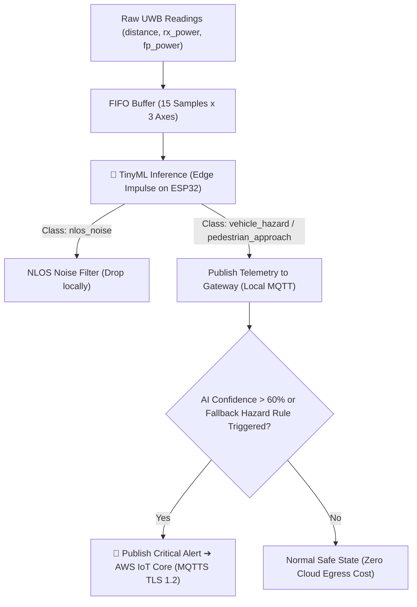

<div align="right">
  🇪🇸 <a href="README.md">Español</a> | 🌎 <b>English</b>
</div>

# Industrial IoT Edge Gateway: TinyML (Edge Impulse), Custom Embedded Linux (Buildroot) & Automated HIL CI/CD Pipeline

[](https://github.com/Rivero-Agustin/embedded-linux-iot-gateway/actions/workflows/build.yml)


An end-to-end **Industrial IoT Collision Avoidance & Edge Gateway** featuring on-device **TinyML Neural Network Inference (Edge Impulse)**, a custom **Embedded Linux (Buildroot)** OS, secure cloud telemetry via **AWS IoT Core**, and a production-grade **CI/CD pipeline with Automated Hardware-in-the-Loop (HIL) Testing**.

---

## 🌟 Executive Summary

> 🎯 **Overview:** Designed for mission-critical industrial environments (warehouses, factories, logistics), this project delivers a resilient Edge-to-Cloud architecture that classifies physical kinematics and filters RF multipath noise using an **on-device TinyML model trained with Edge Impulse**, aggregates and evaluates safety rules on a **custom Embedded Linux Gateway (Buildroot)** (>80% cloud egress reduction), publishes TLS-encrypted telemetry to **AWS IoT Core**, and guarantees firmware reliability via an automated **Hardware-in-the-Loop (HIL) CI/CD pipeline** running on physical target boards.

---

## 🏗️ System Architecture & Data Flow


### 📡 MQTT Communication Matrix

| Topic                   | Publisher ➔ Subscriber  | Transport / Security         | Payload Structure / Purpose                                                                                                                               |
| :---------------------- | :---------------------- | :--------------------------- | :-------------------------------------------------------------------------------------------------------------------------------------------------------- |
| `gateway/uwb/telemetry` | ESP32 ➔ Linux Gateway   | MQTT (TCP:1883 / Local)      | `{"distance_m": 1.45, "ai_state": "vehicle_hazard", "ai_confidence": 0.92, "anchor_id": "...", "tag_id": "..."}` — Telemetry with TinyML inference state. |
| `gateway/uwb/alerts`    | Gateway ➔ AWS IoT Core  | MQTTS (TLS 1.2:8883 / Cloud) | `{"alerta": "COLISION_VEHICULAR_INMINENTE", "severidad": "CRITICA", "distancia_m": 1.45, "confianza": 0.92}` — AI-classified critical alert payload.      |
| `gateway/uwb/commands`  | Cloud / Gateway ➔ ESP32 | MQTT (TCP:1883 / Local)      | Remote calibration & runtime threshold parameter updates.                                                                                                 |

---

## ⚙️ Key Engineering Highlights & Architectural Decisions

### 1. 🧠 On-Device TinyML Inference (Edge Impulse C++ SDK)

The ESP32 firmware executes a neural network trained with Edge Impulse to classify motion kinematics and wireless channel quality in real time:

- **Multi-Channel RF Feature Input:** The network simultaneously evaluates 3 physical layer metrics provided by the DecaWave DW1000 UWB transceiver:
  1. `distance` (computed via Time-of-Flight ranging).
  2. `rx_power` (total received radio frequency signal power).
  3. `fp_power` (first path signal power).
- **4-Class Hazard Classification:**
  - `vehicle_hazard`: Rapid approach of industrial machinery / forklifts towards personnel.
  - `pedestrian_approach`: Standard controlled human movement within the sensing zone.
  - `static_safe`: Stationary nodes in safe operating conditions.
  - `nlos_noise`: Robust rejection of false positives caused by physical obstructions or Non-Line-of-Sight (NLOS) reflections, recognized through the characteristic divergence between `rx_power` and `fp_power`.
- **Deterministic Sliding Window:** Circular temporal buffer of 15 samples ($15 \times 3 = 45$ floats) with zero heap allocations inside the inference loop, running in ~ms under FreeRTOS.

### 2. ⚡ Asymmetric FreeRTOS Dual-Core Architecture (ESP32)

Microcontroller tasks are pinned to physical cores to guarantee hard real-time deadlines:

- **Core 1 (High Priority - Level 5):** Executes nanosecond UWB Time-of-Flight ranging, runs the **Edge Impulse TinyML classifier**, and throttles SSD1306 OLED updates (300 ms) to prevent I2C bus saturation.
- **Core 0 (Standard Priority - Level 2):** Manages the Wi-Fi reconnection state machine and the native ESP-IDF MQTT client (`esp_mqtt_client`) via FreeRTOS queues.
- **Memory Management:** Configured for external PSRAM (`BOARD_HAS_PSRAM`) with custom flash partitions (`partitions.csv`).

### 3. 🐧 Custom Embedded Linux Gateway (Buildroot + QEMU)

- **Minimalist OS Footprint:** Built using a customized Buildroot Linux configuration emulated under QEMU, tailored with minimal packages (Python runtime, Mosquitto broker, OpenSSL).
- **Two-Tier Edge Intelligence & Cloud Cost Reduction:** The Python edge daemon acts as a supervisory tier: evaluates the ESP32 TinyML classification (`vehicle_hazard` confidence > 60%), applies fallback spatial heuristics, and slashes cloud ingress by **>80%**.

### 4. 🔐 Zero-Trust Cloud Security Model (AWS IoT Core)

- Local edge nodes communicate over an isolated local network (MQTT port 1883).
- The Linux Edge Gateway acts as a secure cryptographic boundary, encrypting outbound alert payloads with **TLS v1.2 / MQTTS (Port 8883)** using X.509 device certificates and private keys generated in AWS IoT Core.

---

## 🧪 CI/CD & Hardware-in-the-Loop (HIL) Pipeline


Fully automated two-stage workflow via **GitHub Actions**:

- **Stage 1 (Cloud / Ubuntu Runner):** Dependency caching, Native x86 compilation of pure logic, execution of unit tests with **Unity Framework**, cross-compilation for ESP32 Xtensa architecture, and firmware binary artifact publishing.
- **Stage 2 (Self-Hosted Runner / HIL):** Automated test suite execution on **real physical ESP32 hardware** over serial; on merge to `main`, continuous deployment automatically flashes production firmware with injected secrets.

---

## 🧠 Edge Computing & Anomaly Detection Logic

The system incorporates a two-tier intelligence model (Microcontroller + Edge Gateway):



1. **Primary TinyML Classifier:** The neural model distinguishes between forklift collision threats, pedestrian movement, and NLOS multipath reflections.
2. **Fallback Sustained Danger Rule:** The Gateway confirms whether sustained proximity ($< 2.0\,\text{m}$ for 3 consecutive cycles) triggers redundant safety alerts.
3. **Sensor Glitch / Abrupt Jump:** Sudden deviations $|\Delta d| > 5.0\,\text{m}$ are flagged as sensor glitches or transient line-of-sight dropouts.

---

## 📁 Repository Structure

```plaintext
embedded-linux-iot-gateway/
├── .github/
│   └── workflows/
│       └── build.yml               # GitHub Actions CI/CD (Native tests + HIL Runner + CD)
├── dataset/                        # Real UWB RF datasets for TinyML training
│   ├── nlos_noise/                 # Non-Line-Of-Sight / multipath reflection samples
│   ├── pedestrian_approach/        # Controlled pedestrian approach samples
│   ├── static_safe/                # Static safe zone samples
│   └── vehicle_hazard/             # High-speed vehicle approach samples
├── docs/
│   ├── architecture.diagram.png    # High-resolution system architecture diagram
│   └── pipeline.cicd.png           # Hardware-in-the-Loop CI/CD pipeline diagram
├── firmware/                       # ESP32 C++ / FreeRTOS / ESP-IDF Source
│   ├── include/
│   │   ├── ai_engine.h             # TinyML state machine & API definitions
│   │   ├── config.example.h        # Configuration template (Credentials & Broker URI)
│   │   ├── display_manager.h       # OLED display abstractions
│   │   ├── mqtt_manager.h          # ESP-IDF native MQTT management
│   │   ├── nvs_manager.h           # Non-Volatile Storage handlers
│   │   ├── telemetry_manager.h     # JSON serialization (cJSON) with AI predictions
│   │   ├── uwb_engine.h            # DW1000 UWB driver & RF feature extraction
│   │   └── wifi_manager.h          # Wi-Fi station mode & auto-reconnect routines
│   ├── lib/
│   │   ├── DW1000/                 # DecaWave UWB transceiver driver
│   │   └── ai_model/               # Edge Impulse C++ SDK & trained TFLite model
│   ├── src/
│   │   ├── ai_engine.cpp           # Real-time TinyML inferencing engine
│   │   ├── main.cpp                # Core pinning, dual FreeRTOS tasks & entrypoint
│   │   └── *.cpp                   # Module implementations
│   ├── test/
│   │   └── test_main.cpp           # Unity test suite (Multi-target: Native x86 & ESP32)
│   ├── partitions.csv              # Custom flash partition scheme
│   └── platformio.ini              # Multi-environment PlatformIO configuration
├── gateway/
│   └── gateway.py                  # Buildroot Edge Bridge (Local MQTT + TLS AWS Uplink)
├── README.md                       # Main documentation (Spanish)
└── README-en.md                    # English documentation
```

---

## 🚀 Quickstart & Local Reproduction Guide

### Prerequisites

- **Hardware:** ESP32 development board (e.g., ESP32-WROVER-KIT) with DecaWave DWM1000 / UWB transceiver and SSD1306 I2C OLED display.
- **Software:** VS Code with [PlatformIO IDE](https://platformio.org/), Python 3.10+, WSL2 (Ubuntu), and QEMU.

### 1. Network Routing & Tunneling (WSL2 / Windows Host)

When running QEMU inside WSL2, create a port proxy tunnel to allow the physical ESP32 to reach the emulated broker:

```powershell
# 1. Retrieve WSL IP (PowerShell as Administrator)
wsl -e hostname -i

# 2. Create the portproxy tunnel (replace <WSL_IP> with the obtained IP)
netsh interface portproxy add v4tov4 listenport=1883 listenaddress=0.0.0.0 connectport=1883 connectaddress=<WSL_IP>
```

Add an inbound firewall rule for TCP port 1883 (Private & Domain profiles only).

### 2. Launch the Edge Gateway (QEMU / Buildroot)

Inside your WSL2 terminal, boot the Buildroot Linux image forwarding port 1883 (`hostfwd=tcp:0.0.0.0:1883-:1883`). Inside the emulated terminal:

```bash
# Start the local Mosquitto MQTT broker
mosquitto -d

# Start the AWS Bridge & Anomaly Processing engine
python3 gateway.py
```

### 3. Configure & Flash ESP32 Firmware

```bash
# Navigate to firmware directory
cd firmware

# Create local config from template
cp include/config.example.h include/config.h
```

Edit `include/config.h` with your local Wi-Fi credentials and the IP address of your Windows/Gateway host:

```c
#define WIFI_SSID "YOUR_WIFI_SSID"
#define WIFI_PASS "YOUR_WIFI_PASSWORD"
#define MQTT_BROKER_URI "mqtt://192.168.1.X:1883"
```

Compile and upload the firmware:

```bash
# Run native logic unit tests on host
pio test -e native

# Compile and flash to ESP32 board
pio run -e esp-wrover-kit --target upload
```

> [!WARNING]
> **Security Note:** AWS IoT Core credentials (`root-ca.pem`, `cert.pem.crt`, `private.pem.key`) are not included in this repository. Place them under `/root/certs` in your Linux/QEMU environment.

---

## 🛠️ Tech Stack & Tools

- **Edge AI & Machine Learning:** TinyML, Edge Impulse C++ Inferencing SDK, TensorFlow Lite for Microcontrollers (TFLite Micro).
- **Firmware:** C/C++, FreeRTOS, ESP-IDF Framework, PlatformIO, Unity Test Framework.
- **Transceivers & Sensors:** DecaWave DW1000 (Ultra-Wideband), SSD1306 (I2C OLED).
- **Edge Computing & OS:** Embedded Linux, Buildroot, QEMU Emulation, Python 3, Paho-MQTT, Mosquitto.
- **Cloud & Protocols:** AWS IoT Core, MQTT, MQTTS (TLS 1.2), X.509 Certificates.
- **DevOps & CI/CD:** GitHub Actions, Self-Hosted Runners (Hardware-in-the-Loop).

---

## 👨‍💻 Author

**Agustín Rivero**

- GitHub: [@Rivero-Agustin](https://github.com/Rivero-Agustin)
- LinkedIn: [Agustín Rivero](https://www.linkedin.com/in/agustin-rivero-/)
