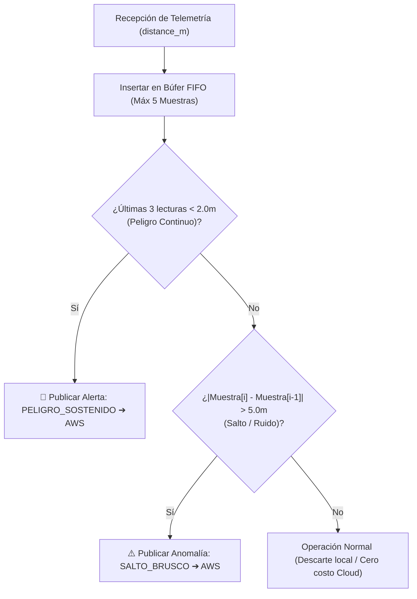

<div align="right">
  🌎 <a href="README.md">English</a> | 🇪🇸 <a href="README-es.md">Español</a>
</div>

# Gateway IoT Edge en Linux Embebido: Buildroot & Pipeline CI/CD con Hardware-in-the-Loop (HIL)

[](https://github.com/Rivero-Agustin/embedded-linux-iot-gateway/actions/workflows/build.yml)


Sistema integral de **Prevención de Colisiones y Gateway IoT Edge** basado en un sistema operativo **Linux Embebido personalizado (Buildroot)**, procesamiento y detección de anomalías en el Edge, firmware FreeRTOS dual-core y un pipeline de **CI/CD con pruebas automatizadas Hardware-in-the-Loop (HIL)**.

---

## 🌟 Resumen Ejecutivo

> 🎯 **Visión General:** Diseñado para entornos industriales de alto riesgo (plantas logísticas, fábricas, minería), este proyecto implementa una arquitectura Edge-to-Cloud que mide distancias físicas vía UWB con precisión decimétrica, ejecuta filtrado de ruido y detección de peligro localmente sobre un Gateway Linux Embebido a medida (>80% reducción de tráfico a la nube), transmite telemetría cifrada a AWS IoT Core y valida automáticamente el firmware sobre hardware físico mediante un pipeline de CI/CD HIL.

---

## 🏗️ Arquitectura del Sistema y Flujo de Datos


### 📡 Matriz de Comunicación MQTT

| Tópico                  | Origen ➔ Destino        | Transporte / Seguridad       | Estructura de Carga / Propósito                                                 |
| :---------------------- | :---------------------- | :--------------------------- | :------------------------------------------------------------------------------ |
| `gateway/uwb/telemetry` | ESP32 ➔ Linux Gateway   | MQTT (TCP:1883 / Local)      | `{"distance_m": 1.45, "role": "ANCHOR"}` — Telemetría de proximidad local.      |
| `gateway/uwb/alerts`    | Gateway ➔ AWS IoT Core  | MQTTS (TLS 1.2:8883 / Cloud) | `{"alerta": "PELIGRO_SOSTENIDO", "distancia": 1.45}` — Carga de evento crítico. |
| `gateway/uwb/commands`  | Cloud / Gateway ➔ ESP32 | MQTT (TCP:1883 / Local)      | Calibración remota y actualización de umbrales.                                 |

---

## ⚙️ Decisiones Clave de Ingeniería y Arquitectura

### 1. ⚡ Arquitectura FreeRTOS Asimétrica Dual-Core (ESP32)

Las tareas del microcontrolador están desacopladas y ancladas a núcleos físicos específicos para asegurar tiempos deterministas:

- **Core 1 (Prioridad Alta - Nivel 5):** Dedicado exclusivamente al algoritmo Two-Way Ranging (TWR) del transceptor UWB a resolución de nanosegundos y a la actualización no bloqueante de la pantalla OLED SSD1306 (con limitador de 300 ms para evitar saturar el bus I2C).
- **Core 0 (Prioridad Estándar - Nivel 2):** Gestiona la máquina de estados de conexión Wi-Fi y el cliente MQTT nativo de ESP-IDF (`esp_mqtt_client`) con colas de mensajes.
- **Memoria PSRAM y Particiones Personalizadas:** Configuración de `partitions.csv` y flags de compilación para memoria PSRAM externa.

### 2. 🐧 Gateway Edge en Linux Embebido Personalizado (Buildroot + QEMU)

- **Sistema Operativo Minimalista:** Compilado a medida mediante Buildroot y emulado en QEMU, conteniendo exclusivamente los paquetes esenciales (Python 3, Mosquitto broker, OpenSSL).
- **Filtrado Edge y Reducción de Ancho de Banda:** Un servicio en Python procesa la telemetría cruda mediante un búfer de ventana deslizante ($N=5$). Al evaluar las reglas de peligro en el Edge, se reduce la ingesta de datos en la nube en más de un **80%**, transmitiendo únicamente alertas procesables a AWS.

### 3. 🔐 Modelo de Seguridad y Enlace Seguro con AWS IoT Core

- La red de sensores local opera en una subred aislada (MQTT puerto 1883).
- El Gateway actúa como frontera de seguridad criptográfica, encapsulando las alertas hacia AWS IoT Core a través de **MQTTS / TLS v1.2 (Puerto 8883)** utilizando certificados de dispositivo X.509 y claves privadas.

---

## 🧪 Pipeline de CI/CD y Hardware-in-the-Loop (HIL)


Flujo automatizado en dos etapas mediante **GitHub Actions**:

- **Etapa 1 (Nube / GitHub Runner Ubuntu):** Caché de dependencias, compilación de lógica pura para x86, ejecución de pruebas unitarias con **Unity Framework**, compilación cruzada para Xtensa (ESP32) y exportación del binario.
- **Etapa 2 (Runner Local / HIL):** Ejecución de pruebas unitarias directamente sobre la **placa física ESP32** vía puerto serie; ante un `push` a la rama `main`, despliegue continuo (CD) flasheando el firmware de producción con credenciales seguras inyectadas.

---

## 🧠 Lógica de Detección de Anomalías y Reglas en el Edge

El Gateway mantiene una cola FIFO acotada ($N=5$) para evaluar condiciones espacio-temporales localmente:



1. **Peligro Sostenido (`PELIGRO_SOSTENIDO`):** Se dispara cuando la distancia es $< 2.0\,\text{m}$ durante 3 lecturas consecutivas, descartando falsos positivos transitorios.
2. **Salto Brusco / Anomalía (`SALTO_BRUSCO`):** Se dispara si la variación entre dos lecturas inmediatas $|\Delta d| > 5.0\,\text{m}$, filtrando rebotes multitrayectoria o fallas temporales de línea de vista (NLOS).

---

## 📁 Estructura del Repositorio

```plaintext
embedded-linux-iot-gateway/
├── .github/
│   └── workflows/
│       └── build.yml               # Pipeline GitHub Actions (Tests x86 + Runner HIL + CD)
├── docs/
│   ├── architecture.diagram.png    # Diagrama de arquitectura del sistema en alta resolución
│   └── pipeline.cicd.png           # Diagrama del pipeline CI/CD con Hardware-in-the-Loop
├── firmware/                       # Código fuente C++ / FreeRTOS / ESP-IDF para ESP32
│   ├── include/
│   │   ├── config.example.h        # Plantilla de configuración (Credenciales y Broker URI)
│   │   ├── display_manager.h       # Módulo de control de pantalla OLED
│   │   ├── mqtt_manager.h          # Gestión del cliente MQTT nativo ESP-IDF
│   │   ├── nvs_manager.h           # Manejo de memoria no volátil (NVS)
│   │   ├── telemetry_manager.h     # Serialización de telemetría JSON (cJSON)
│   │   ├── uwb_engine.h            # Driver DW1000 y máquina de estados UWB
│   │   └── wifi_manager.h          # Conectividad Wi-Fi y reconexión automática
│   ├── src/
│   │   ├── main.cpp                # Asignación de tareas a núcleos y punto de entrada
│   │   └── *.cpp                   # Implementación de módulos
│   ├── test/
│   │   └── test_main.cpp           # Suite de tests Unity (Dual: Nativo x86 y ESP32)
│   ├── partitions.csv              # Tabla de particiones de memoria Flash
│   └── platformio.ini              # Configuración multi-entorno PlatformIO
├── gateway/
│   └── gateway.py                  # Puente Edge en Buildroot (MQTT Local + TLS AWS)
├── README.md                       # Documentación en inglés
└── README-es.md                    # Documentación en español
```

---

## 🚀 Guía de Puesta en Marcha y Despliegue Local

### Requisitos Previos

- **Hardware:** Placa de desarrollo ESP32 (ej. ESP32-WROVER-KIT) con módulo UWB DecaWave DW1000 y pantalla OLED SSD1306 (I2C).
- **Software:** VS Code con extensión [PlatformIO IDE](https://platformio.org/), Python 3.10+, WSL2 (Ubuntu) y QEMU.

### 1. Configuración de Red y Túnel (WSL2 / Windows Host)

Al ejecutar QEMU dentro de WSL2, se debe crear un túnel de reenvío de puertos para permitir la comunicación del ESP32 físico con el broker emulado:

```powershell
# 1. Obtener la IP dinámica de WSL (PowerShell como Administrador)
wsl -e hostname -i

# 2. Crear el túnel portproxy (reemplazar <IP_WSL> por la obtenida)
netsh interface portproxy add v4tov4 listenport=1883 listenaddress=0.0.0.0 connectport=1883 connectaddress=<IP_WSL>
```

Añadir una regla de entrada en el Firewall de Windows para el puerto TCP 1883 (marcando únicamente perfiles Privado y Dominio).

### 2. Iniciar el Gateway Edge (QEMU / Buildroot)

Dentro de la terminal de WSL2, arrancar la imagen Buildroot Linux con el reenvío de puerto activo (`hostfwd=tcp:0.0.0.0:1883-:1883`). En la consola emulada:

```bash
# Iniciar broker MQTT local en segundo plano
mosquitto -d

# Ejecutar el motor de procesamiento Edge y puente a AWS
python3 gateway.py
```

### 3. Configuración y Flasheo del Firmware ESP32

```bash
# Entrar al directorio del firmware
cd firmware

# Copiar la plantilla de configuración
cp include/config.example.h include/config.h
```

Editar `include/config.h` con las credenciales Wi-Fi locales y la dirección IP del host Windows/Gateway:

```c
#define WIFI_SSID "TU_RED_WIFI"
#define WIFI_PASS "TU_CONTRASEÑA"
#define MQTT_BROKER_URI "mqtt://192.168.1.X:1883"
```

Compilar y flashear el firmware:

```bash
# Ejecutar tests unitarios nativos en host x86
pio test -e native

# Compilar y flashear al ESP32 físico
pio run -e esp-wrover-kit --target upload
```

> [!WARNING]
> **Nota de Seguridad:** Los certificados de AWS IoT Core (`root-ca.pem`, `cert.pem.crt`, `private.pem.key`) no están incluidos en el repositorio. Deben colocarse en `/root/certs` dentro del entorno Linux / QEMU.

---

## 🛠️ Stack Tecnológico y Herramientas

- **Firmware:** C/C++, FreeRTOS, ESP-IDF Framework, PlatformIO, Unity Test Framework.
- **Transceptores y Sensores:** DecaWave DW1000 (Ultra-Wideband), SSD1306 (OLED I2C).
- **Edge Computing y SO:** Linux Embebido, Buildroot, Emulación QEMU, Python 3, Paho-MQTT, Mosquitto.
- **Cloud y Protocolos:** AWS IoT Core, MQTT, MQTTS (TLS 1.2), Certificados X.509.
- **DevOps y CI/CD:** GitHub Actions, Self-Hosted Runners (Hardware-in-the-Loop).

---

## 👨‍💻 Autor

**Agustín Rivero**

- GitHub: [@Rivero-Agustin](https://github.com/Rivero-Agustin)
- LinkedIn: [Agustín Rivero](https://www.linkedin.com/in/agustin-rivero-/)
