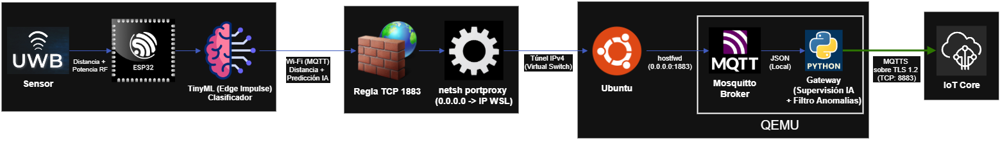

# Custom Embedded Linux Edge Gateway: Buildroot & QEMU

<!-- Badges de Tecnologías -->


Sistema IoT de detección de colisiones utilizando tecnología UWB (Ultra-Wideband) con ESP32, un Gateway local (Edge Computing) emulado en Linux/QEMU, y conexión segura a AWS IoT Core.

---

## 🏗️ Arquitectura del Sistema



El proyecto se divide en tres capas principales:

1. **Percepción (Hardware):** Nodos ESP32 (Tags y Anchors) con módulos UWB midiendo distancias físicas.
2. **Edge Computing (Gateway):** Un entorno Linux ligero (Buildroot) emulado en QEMU. Ejecuta un script en Python que procesa la telemetría, aplica reglas de negocio (detección de anomalías/colisiones) y actúa como puente.
3. **Nube (AWS IoT Core):** Recepción de alertas críticas mediante MQTT sobre TLS (MQTTS).

---

## 📁 Estructura del Repositorio

- `firmware/`: Código fuente C++ para el ESP32 (Anchor y Tag con PlatformIO).
- `gateway/`: Script principal en Python `gateway.py` que corre en el entorno Linux.
- `README.md`: Documentación y guía de despliegue.

> [!WARNING]
> **Nota de Seguridad:** Los certificados de AWS (`.pem`, `.key`, `.crt`) necesarios para el Gateway **NO** están incluidos en este repositorio por seguridad. Deben generarse en AWS IoT Core y ubicarse en el entorno Linux / QEMU (`/root/certs`).

---

## 🚀 Guía de Despliegue Local (Entorno Windows / WSL2)

Debido a que el Gateway se ejecuta en QEMU dentro de WSL2 (Windows Subsystem for Linux), es necesario configurar el enrutamiento de red para que el ESP32 físico pueda comunicarse con el broker MQTT emulado.

### 1. Configuración de Red en Windows (Portproxy)

WSL2 asigna una IP dinámica en cada reinicio. Para que el ESP32 alcance a QEMU, debemos crear un túnel.

1. Abrir **PowerShell como Administrador** y obtener la IP de WSL:

   ```powershell
   wsl -e hostname -i
   ```

2. Crear el túnel (reemplazar `<IP_WSL>` por la obtenida):
   ```powershell
   netsh interface portproxy add v4tov4 listenport=1883 listenaddress=0.0.0.0 connectport=1883 connectaddress=<IP_WSL>
   ```

### 2. Configuración del Firewall de Windows

Para permitir la entrada de telemetría desde el ESP32:

1. Abrir **Firewall de Windows Defender con seguridad avanzada**.
2. Crear una **Nueva Regla de Entrada** -> **Puerto** -> **TCP** -> `1883`.
3. Seleccionar **Permitir conexión**.
4. **Importante:** Marcar solo los perfiles _Dominio_ y _Privado_ (dejar _Público_ desmarcado para evitar vulnerabilidades en redes abiertas).

### 3. Ejecución del Gateway (QEMU)

Dentro de la terminal de Ubuntu (WSL), levantar el sistema emulado asegurando que el reenvío de puertos esté configurado (`hostfwd=tcp:0.0.0.0:1883-:1883` en el script de arranque).

Una vez dentro de QEMU, iniciar el broker y el script puente:

```bash
# Iniciar broker MQTT local en segundo plano (si no inicia automáticamente)
mosquitto -d

# Ejecutar el puente hacia AWS
python3 gateway.py
```

### 4. Configuración del Firmware ESP32

1. Copiar `firmware/include/config.example.h` a `firmware/include/config.h`:
   ```bash
   cp firmware/include/config.example.h firmware/include/config.h
   ```
2. Modificar `config.h` con tus credenciales de red y la IP local de tu PC Windows:
   ```c
   #define WIFI_SSID "TU_RED_WIFI"
   #define WIFI_PASS "TU_CONTRASEÑA"
   #define MQTT_BROKER_URI "mqtt://192.168.1.X:1883"
   ```
3. Compilar y subir el firmware al ESP32 utilizando **PlatformIO**.

---

## 📡 Tópicos MQTT

| Tópico                  | Origen ➔ Destino       | Protocolo          | Descripción                                       |
| :---------------------- | :--------------------- | :----------------- | :------------------------------------------------ |
| `gateway/uwb/telemetry` | ESP32 ➔ Gateway        | MQTT (1883)        | Telemetría local con mediciones de distancia UWB. |
| `gateway/uwb/alerts`    | Gateway ➔ AWS IoT Core | MQTTS (8883 / TLS) | Alertas de proximidad crítica o anomalías.        |

---

## ⚙️ Reglas de Detección de Colisiones (Edge)

El Gateway evalúa los datos localmente para reducir la latencia y el consumo de ancho de banda hacia la nube:

- **Peligro Sostenido:** Se dispara si la distancia medida es **< 2.0 m** durante 3 lecturas consecutivas.
- **Salto Brusco (Anomalía):** Se dispara si la diferencia entre dos lecturas consecutivas es **> 5.0 m** (filtro de ruido y fallo de medición del sensor).
