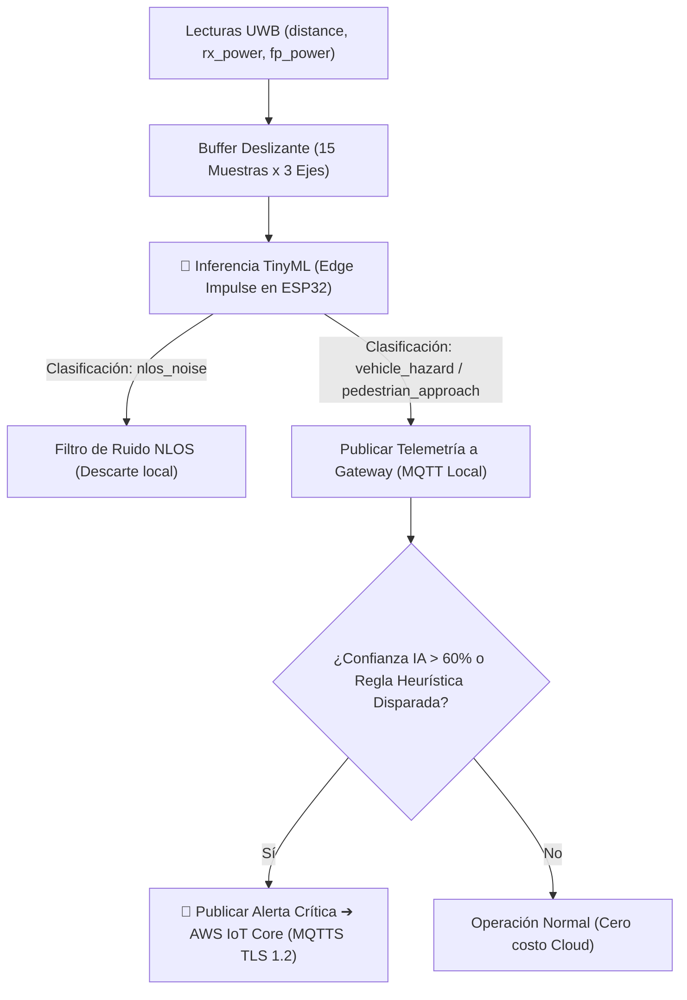

<div align="right">
  🇪🇸 <b>Español</b> | 🌎 <a href="README-en.md">English</a>
</div>

# Gateway IoT Edge: TinyML (Edge Impulse), Linux Embebido (Buildroot) & CI/CD Hardware-in-the-Loop (HIL)

[](https://github.com/Rivero-Agustin/embedded-linux-iot-gateway/actions/workflows/build.yml)


Sistema integral de **Prevención de Colisiones y Gateway IoT Edge** que combina **redes neuronales TinyML en microcontrolador (Edge Impulse)**, un sistema operativo **Linux Embebido a medida (Buildroot)**, telemetría segura hacia **AWS IoT Core** y un pipeline de **CI/CD con pruebas automatizadas Hardware-in-the-Loop (HIL)**.

---

## 🌟 Resumen Ejecutivo

> 🎯 **Visión General:** Diseñado para entornos industriales de alto riesgo (plantas logísticas, minería, fábricas), este proyecto implementa una arquitectura Edge-to-Cloud que clasifica trayectorias físicas y filtra ruido RF mediante un **modelo TinyML entrenado con Edge Impulse** directamente en el microcontrolador, procesa y correlaciona eventos localmente sobre un **Gateway Linux Embebido (Buildroot)** (>80% reducción de ancho de banda cloud), transmite alertas críticas encriptadas a **AWS IoT Core** y asegura la calidad del firmware mediante **pruebas Hardware-in-the-Loop (HIL)** automáticas sobre la placa física.

---

## 🏗️ Arquitectura del Sistema y Flujo de Datos


### 📡 Matriz de Comunicación MQTT

| Tópico                  | Origen ➔ Destino        | Transporte / Seguridad       | Estructura de Carga / Propósito                                                                                                                      |
| :---------------------- | :---------------------- | :--------------------------- | :--------------------------------------------------------------------------------------------------------------------------------------------------- |
| `gateway/uwb/telemetry` | ESP32 ➔ Linux Gateway   | MQTT (TCP:1883 / Local)      | `{"distance_m": 1.45, "ai_state": "vehicle_hazard", "ai_confidence": 0.92, "anchor_id": "...", "tag_id": "..."}` — Telemetría con inferencia TinyML. |
| `gateway/uwb/alerts`    | Gateway ➔ AWS IoT Core  | MQTTS (TLS 1.2:8883 / Cloud) | `{"alerta": "COLISION_VEHICULAR_INMINENTE", "severidad": "CRITICA", "distancia_m": 1.45, "confianza": 0.92}` — Alerta clasificada por IA.            |
| `gateway/uwb/commands`  | Cloud / Gateway ➔ ESP32 | MQTT (TCP:1883 / Local)      | Calibración remota y actualización de umbrales.                                                                                                      |

---

## ⚙️ Decisiones Clave de Ingeniería y Arquitectura

### 1. 🧠 Inferencia TinyML On-Device (Edge Impulse C++ SDK)

El firmware del ESP32 ejecuta una red neuronal optimizada para clasificar en tiempo real la cinemática y la calidad del enlace de radio:

- **Insumo Multicanal de RF:** La red analiza simultáneamente 3 características físicas provistas por el transceptor UWB (DecaWave DW1000):
  1. `distance` (distancia calculada por Time-of-Flight).
  2. `rx_power` (potencia total recibida de la señal RF).
  3. `fp_power` (potencia del primer camino / First Path Power).
- **Clasificación en 4 Estados:**
  - `vehicle_hazard`: Aproximación veloz de maquinaria pesada / montacargas hacia el operario.
  - `pedestrian_approach`: Movimiento peatonal estándar a velocidad controlada.
  - `static_safe`: Operación estacionaria sin riesgo cinemático.
  - `nlos_noise`: Filtrado de falsos positivos causados por reflexiones u obstrucciones físicas (Non-Line-of-Sight), diferenciadas gracias al desfase entre `rx_power` y `fp_power`.
- **Ventana Deslizante Determinista:** Buffer temporal de 15 muestras ($15 \times 3 = 45$ floats) con inferencia ultrarrápida (~ms) en FreeRTOS sin memoria dinámica en el bucle caliente.

### 2. ⚡ Arquitectura FreeRTOS Asimétrica Dual-Core (ESP32)

Las tareas del microcontrolador están segregadas físicamente para garantizar tiempos deterministas:

- **Core 1 (Prioridad Alta - Nivel 5):** Dedicado exclusivamente al procesamiento ToF UWB en nanosegundos, a la **inferencia TinyML (Edge Impulse)** y a la actualización de la pantalla OLED SSD1306 (con limitador a 300 ms).
- **Core 0 (Prioridad Estándar - Nivel 2):** Gestiona la pila Wi-Fi y el cliente MQTT nativo de ESP-IDF (`esp_mqtt_client`) desacoplado mediante colas FreeRTOS.
- **Optimización de Memoria:** Soporte de memoria externa PSRAM (`BOARD_HAS_PSRAM`) y tabla de particiones personalizada (`partitions.csv`).

### 3. 🐧 Gateway Edge en Linux Embebido Personalizado (Buildroot + QEMU)

- **Sistema Operativo Minimalista:** Compilado a medida mediante Buildroot y emulado en QEMU, conteniendo exclusivamente los paquetes esenciales (Python 3, Mosquitto broker, OpenSSL).
- **Inteligencia de Borde & Reducción Cloud:** El servicio en Python actúa como segundo nivel de decisión: correlaciona la predicción TinyML del ESP32 (`vehicle_hazard` con confianza > 60%), evalúa reglas heurísticas de respaldo y reduce la ingesta de datos a la nube en más del **80%**.

### 4. 🔐 Modelo de Seguridad y Enlace Seguro con AWS IoT Core

- La red de sensores local opera en una subred aislada (MQTT puerto 1883).
- El Gateway actúa como frontera de seguridad criptográfica, encapsulando las alertas hacia AWS IoT Core a través de **MQTTS / TLS v1.2 (Puerto 8883)** utilizando certificados de dispositivo X.509 y claves privadas.

---

## 🧪 Pipeline de CI/CD y Hardware-in-the-Loop (HIL)


Flujo automatizado en dos etapas mediante **GitHub Actions**:

- **Etapa 1 (Nube / GitHub Runner Ubuntu):** Caché de dependencias, compilación de lógica pura para x86, ejecución de pruebas unitarias con **Unity Framework**, compilación cruzada para Xtensa (ESP32) y exportación del binario.
- **Etapa 2 (Runner Local / HIL):** Ejecución de pruebas unitarias directamente sobre la **placa física ESP32** vía puerto serie; ante un `push` a la rama `main`, despliegue continuo (CD) flasheando el firmware de producción con credenciales seguras inyectadas.

---

## 🧠 Lógica de Detección de Anomalías y Reglas en el Edge

El sistema opera con una arquitectura de inteligencia de dos niveles (Microcontrolador + Gateway):



1. **Inferencia TinyML Primaria:** El clasificador neuronal discrimina entre peligro de vehículo, aproximación de peatón y ruido de sensor NLOS.
2. **Peligro Sostenido de Respaldo:** El Gateway valida que distancias críticas sostenidas ($< 2.0\,\text{m}$ durante 3 lecturas) activen alertas de seguridad redundantes.
3. **Filtro de Saltos Bruscos:** Variaciones inmediatas $|\Delta d| > 5.0\,\text{m}$ son catalogadas como anomalías de sensor o pérdida temporal de línea de vista.

---

## 📁 Estructura del Repositorio

```plaintext
embedded-linux-iot-gateway/
├── .github/
│   └── workflows/
│       └── build.yml               # Pipeline GitHub Actions (Tests x86 + Runner HIL + CD)
├── dataset/                        # Datasets UWB recolectados para entrenamiento TinyML
│   ├── nlos_noise/                 # Muestras de ruido por obstrucción / reflexiones RF
│   ├── pedestrian_approach/        # Muestras de aproximación peatonal
│   ├── static_safe/                # Muestras en reposo / zona segura
│   └── vehicle_hazard/             # Muestras de aproximación de alta velocidad (vehículo)
├── docs/
│   ├── architecture.diagram.png    # Diagrama de arquitectura del sistema en alta resolución
│   └── pipeline.cicd.png           # Diagrama del pipeline CI/CD con Hardware-in-the-Loop
├── firmware/                       # Código fuente C++ / FreeRTOS / ESP-IDF para ESP32
│   ├── include/
│   │   ├── ai_engine.h             # Definición de estados y API del clasificador TinyML
│   │   ├── config.example.h        # Plantilla de configuración (Credenciales y Broker URI)
│   │   ├── display_manager.h       # Módulo de control de pantalla OLED
│   │   ├── mqtt_manager.h          # Gestión del cliente MQTT nativo ESP-IDF
│   │   ├── nvs_manager.h           # Manejo de memoria no volátil (NVS)
│   │   ├── telemetry_manager.h     # Serialización de telemetría JSON (cJSON) con datos IA
│   │   ├── uwb_engine.h            # Driver DW1000 y extracción de features RF
│   │   └── wifi_manager.h          # Conectividad Wi-Fi y reconexión automática
│   ├── lib/
│   │   ├── DW1000/                 # Driver del transceptor UWB
│   │   └── ai_model/               # C++ SDK & modelo TFLite exportado de Edge Impulse
│   ├── src/
│   │   ├── ai_engine.cpp           # Pipeline de inferencia TinyML en tiempo real
│   │   ├── main.cpp                # Asignación de tareas a núcleos y punto de entrada
│   │   └── *.cpp                   # Implementación de módulos
│   ├── test/
│   │   └── test_main.cpp           # Suite de tests Unity (Dual: Nativo x86 y ESP32)
│   ├── partitions.csv              # Tabla de particiones de memoria Flash
│   └── platformio.ini              # Configuración multi-entorno PlatformIO
├── gateway/
│   └── gateway.py                  # Puente Edge en Buildroot (MQTT Local + TLS AWS)
├── README.md                       # Documentación principal en español
└── README-en.md                    # English documentation
```

---

## 🚀 Guía de Puesta en Marcha y Despliegue Local

### Requisitos Previos

- **Hardware:** Placa de desarrollo ESP32 (ej. ESP32-WROVER-KIT) con módulo UWB DecaWave DW1000 y pantalla OLED SSD1306 (I2C).
- **Software:** VS Code con extensión [PlatformIO IDE](https://platformio.org/), Python 3.10+, WSL2 (Ubuntu) y QEMU.

### 1. Configuración de Red y Túnel (WSL2 / Windows Host)

Al ejecutar QEMU dentro de WSL2, se debe crear un túnel de reenvío de puertos para permitir la comunicación del ESP32 físico con el broker emulado:

```powershell
# 1. Obtener la IP dinámica de WSL (PowerShell como Administrador)
wsl -e hostname -i

# 2. Crear el túnel portproxy (reemplazar <IP_WSL> por la obtenida)
netsh interface portproxy add v4tov4 listenport=1883 listenaddress=0.0.0.0 connectport=1883 connectaddress=<IP_WSL>
```

Añadir una regla de entrada en el Firewall de Windows para el puerto TCP 1883 (marcando únicamente perfiles Privado y Dominio).

### 2. Iniciar el Gateway Edge (QEMU / Buildroot)

Dentro de la terminal de WSL2, arrancar la imagen Buildroot Linux con el reenvío de puerto activo (`hostfwd=tcp:0.0.0.0:1883-:1883`). En la consola emulada:

```bash
# Iniciar broker MQTT local en segundo plano
mosquitto -d

# Ejecutar el motor de procesamiento Edge y puente a AWS
python3 gateway.py
```

### 3. Configuración y Flasheo del Firmware ESP32

```bash
# Entrar al directorio del firmware
cd firmware

# Copiar la plantilla de configuración
cp include/config.example.h include/config.h
```

Editar `include/config.h` con las credenciales Wi-Fi locales y la dirección IP del host Windows/Gateway:

```c
#define WIFI_SSID "TU_RED_WIFI"
#define WIFI_PASS "TU_CONTRASEÑA"
#define MQTT_BROKER_URI "mqtt://192.168.1.X:1883"
```

Compilar y flashear el firmware:

```bash
# Ejecutar tests unitarios nativos en host x86
pio test -e native

# Compilar y flashear al ESP32 físico
pio run -e esp-wrover-kit --target upload
```

> [!WARNING]
> **Nota de Seguridad:** Los certificados de AWS IoT Core (`root-ca.pem`, `cert.pem.crt`, `private.pem.key`) no están incluidos en el repositorio. Deben colocarse en `/root/certs` dentro del entorno Linux / QEMU.

---

## 🛠️ Stack Tecnológico y Herramientas

- **Inteligencia Artificial en el Borde:** TinyML, Edge Impulse C++ Inferencing SDK, TensorFlow Lite for Microcontrollers (TFLite Micro).
- **Firmware:** C/C++, FreeRTOS, ESP-IDF Framework, PlatformIO, Unity Test Framework.
- **Transceptores y Sensores:** DecaWave DW1000 (Ultra-Wideband), SSD1306 (OLED I2C).
- **Edge Computing y SO:** Linux Embebido, Buildroot, Emulación QEMU, Python 3, Paho-MQTT, Mosquitto.
- **Cloud y Protocolos:** AWS IoT Core, MQTT, MQTTS (TLS 1.2), Certificados X.509.
- **DevOps y CI/CD:** GitHub Actions, Self-Hosted Runners (Hardware-in-the-Loop).

---

## 👨‍💻 Autor

**Agustín Rivero**

- GitHub: [@Rivero-Agustin](https://github.com/Rivero-Agustin)
- LinkedIn: [Agustín Rivero](https://www.linkedin.com/in/agustin-rivero-/)
